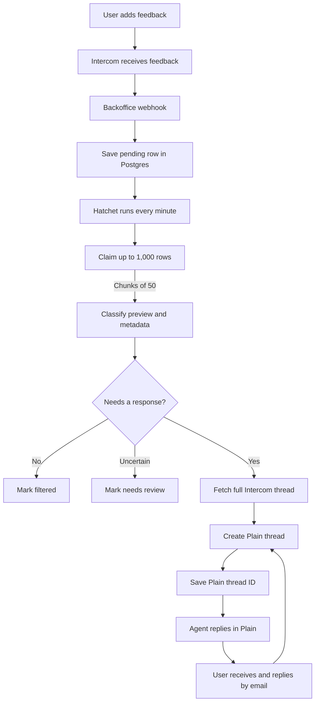
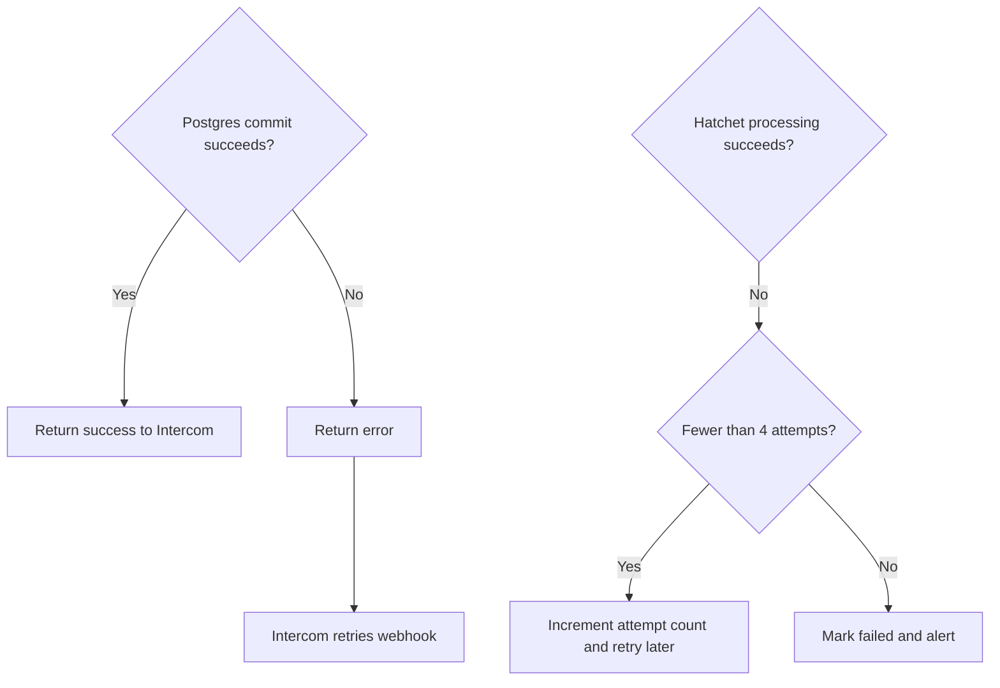

# XAI Support Intake Plan

## Goal

Route actionable XAI feedback from Intercom into Plain without filling Plain
with prompt tests, general sentiment, spam, or other feedback that does not need
a human response.

Plain becomes the support system of record after an intake is accepted. Agents
reply in Plain, customers receive email, and customer email replies return to
the same Plain thread.

## System flow



The classifier uses the saved preview and metadata. The full Intercom thread is
fetched only after the intake is accepted for Plain.

## Failure handling



Backoffice must not acknowledge the webhook until the Postgres transaction
commits. Intercom retries a failed notification only once after one minute, so
webhook failures need monitoring. A durable ingress queue can be added later if
that retry window is not sufficient.

## Data model

Use one `support_intake` table:

```text
id

source_type
source_thread_id
source_event_id
source_url

intercom_thread_id
plain_thread_id

content_preview
content_hash

product
category
actionable
confidence
classification_reason
classifier_version

status
attempt_count
next_attempt_at
processing_started_at
last_error

received_at
processed_at
updated_at
```

The internal `id` is canonical. The generic source fields power ingestion and
deduplication. `intercom_thread_id` and `plain_thread_id` remain explicit,
nullable integration references.

Add a unique constraint on:

```text
(source_type, source_thread_id)
```

Supported statuses:

```text
pending
processing
retry
filtered
needs_review
delivered
failed
```

## Hatchet batch workflow

Run one scheduled workflow every minute.

1. Select up to 1,000 rows where:
   - `status` is `pending` or `retry`
   - `attempt_count < 4`
   - `next_attempt_at` is null or due
2. Claim rows in chunks of 50 with `FOR UPDATE SKIP LOCKED`.
3. Process up to 10 rows concurrently within each chunk.
4. Classify the saved preview and metadata.
5. Save the classification immediately.
6. Mark unactionable rows `filtered`.
7. Mark uncertain rows `needs_review`.
8. For actionable rows:
   - Fetch the full Intercom thread.
   - Confirm that the customer has an email address.
   - Upsert the customer in Plain.
   - Create the Plain thread idempotently.
   - Save `plain_thread_id`.
   - Mark the row `delivered`.
9. On a temporary failure:
   - Increment `attempt_count`.
   - Set `status = retry`.
   - Set `next_attempt_at`.
10. After the fourth failed attempt:
    - Set `status = failed`.
    - Keep `last_error`.
    - Emit an alert.

Suggested retry delays are one minute, five minutes, and fifteen minutes.
Recover stale `processing` rows after a processing lease expires.

Use the internal intake `id` as Plain's external idempotency key. If Plain
creates a thread but the Backoffice update fails, the retry must find the
existing Plain thread instead of creating a duplicate.

## TODO

### 1. Route Intercom feedback into Backoffice

- [ ] Add a public HTTPS webhook endpoint.
- [ ] Support `HEAD` for Intercom endpoint validation.
- [ ] Verify the Intercom signature against the raw request body.
- [ ] Validate and normalize supported webhook topics.
- [ ] Persist the `support_intake` row.
- [ ] Make repeated notifications idempotent.
- [ ] Configure the production webhook in Intercom.
- [ ] Add webhook latency, failure, and signature alerts.
- [ ] Test duplicates and database failure behavior.

#### Backoffice implementation

1. Add an endpoint such as:

   ```text
   POST /api/webhooks/intercom/support-feedback
   ```

2. Return `200` for `HEAD` requests. Intercom uses `HEAD` to validate the
   endpoint URL.
3. Read the raw request body before parsing JSON.
4. Read the `X-Hub-Signature` header.
5. Compute HMAC-SHA1 over the raw body using the Intercom app client secret.
6. Compare `sha1=<hex digest>` to the received signature with a timing-safe
   comparison.
7. Reject requests with missing or invalid signatures.
8. Accept only expected topics:
   - `conversation.user.created`
   - `conversation.user.replied`, if follow-up Intercom messages should be
     reconsidered
9. Extract and normalize:
   - Intercom notification ID
   - Intercom thread ID
   - First 140 characters of user content
   - Product and application metadata
   - Received timestamp
10. Strip HTML, normalize whitespace, and redact obvious secrets from
    `content_preview`.
11. Insert or update the `support_intake` row with:

    ```text
    source_type = intercom
    source_thread_id = <Intercom thread ID>
    source_event_id = <Intercom notification ID>
    intercom_thread_id = <Intercom thread ID>
    status = pending
    attempt_count = 0
    ```

12. Commit the Postgres transaction before returning `200`.
13. Keep the endpoint below Intercom's five-second deadline. Target less than
    500ms.
14. Return an error when Postgres does not commit so Intercom can retry.

#### Intercom configuration

1. Open the
   [Intercom Developer Hub](https://app.intercom.com/a/apps/_/developer-hub).
2. Select the internal app installed in the support workspace.
3. Open **Configure → Authentication**.
4. Enable **Read conversations**.
5. Open **Configure → Webhooks**.
6. Enter the production Backoffice HTTPS endpoint.
7. Select `conversation.user.created`.
8. Add `conversation.user.replied` only if follow-up messages should be
   processed.
9. Save and set the integration live.
10. Submit test feedback.
11. Confirm:
    - Signature verification passes.
    - One database row is created.
    - Duplicate delivery updates or ignores the same row.
    - The endpoint responds within five seconds.
    - Invalid signatures are rejected.
    - A failed database write does not return success.

Intercom subscriptions belong to an app and receive notifications from every
workspace where that app is installed. Confirm that the selected app and
workspace scope are correct before enabling production delivery.

### 2. Build the `needs_response` classifier

- [ ] Agree on actionable and unactionable categories.
- [ ] Build a labeled evaluation dataset.
- [ ] Define a typed, structured classifier response.
- [ ] Implement deterministic checks before the model call.
- [ ] Persist the classifier result and version.
- [ ] Add uncertain-result review handling.
- [ ] Run the classifier in shadow mode.
- [ ] Measure false positives and false negatives.
- [ ] Enable automatic Plain delivery after validation.

#### Classifier input

```text
content_preview
product
platform
app_version
feedback_type
other available structured metadata
```

Validate whether 140 characters provides enough context with historical
feedback. Increase the preview length if important requests are regularly
truncated.

#### Classifier output

```json
{
  "decision": "respond",
  "category": "bug_report",
  "confidence": 0.94,
  "reason": "The user describes a repeatable crash and needs help",
  "classifierVersion": "v1"
}
```

Valid decisions:

```text
respond
do_not_respond
review
```

Send to Plain:

- Bugs with useful details
- Billing, account, or access issues
- Direct product questions
- Explicit requests for help
- Safety or privacy concerns

Do not send:

- Praise or general frustration
- Prompt submissions and tests
- Commentary without a support request
- Spam and abuse
- Empty or meaningless feedback

Route ambiguous feedback to `review`. Do not create a Plain thread while the
decision remains uncertain.

#### Classifier rollout

1. Sample representative historical XAI feedback.
2. Have humans label each example as `respond`, `do_not_respond`, or `review`.
3. Include difficult examples and known sources of unactionable feedback.
4. Implement structured model output with strict parsing.
5. Store the decision, category, reason, confidence, and classifier version.
6. Run without creating Plain threads.
7. Compare predictions against the human labels.
8. Review samples from both accepted and rejected groups.
9. Tune the prompt, examples, and decision policy.
10. Enable Plain delivery only after the measured error rate is acceptable.

Do not treat the model's self-reported confidence as calibrated until it has
been compared against the labeled evaluation set.

## Open questions

- Which Intercom metadata reliably identifies each XAI product?
- Should specific feature requests enter Plain?
- Where should `needs_review` rows appear?
- What should happen when actionable feedback has no customer email?
- Is a 140-character preview sufficient for classification?
- Is Intercom's single retry sufficient, or is a durable ingress queue needed?
- Which Plain labels, fields, team, and priority should each category use?

## References

- [Intercom: Set up webhooks](https://developers.intercom.com/docs/webhooks/setting-up-webhooks)
- [Intercom: Webhook topics and signed notifications](https://developers.intercom.com/docs/references/webhooks/webhook-models)
- [Intercom: Webhook delivery behavior](https://developers.intercom.com/docs/webhooks/webhook-notifications)
- [Plain: Create threads](https://www.plain.com/docs/graphql/threads/create)
- [Plain: Reply to threads](https://www.plain.com/docs/graphql/messaging/reply-to-thread)
